# Juice Benchmark

This repository contains benchmark tests comparing the performance of Juice ORM against GORM and standard database/sql operations.

## Benchmark Results

All tests run on Apple M1 (darwin/arm64)

### Performance Visualization

```mermaid
gantt
    title Performance Comparison (ns/op, lower is better)
    dateFormat X
    axisFormat %s

    section Single Create
    STD DB    : 0, 146987
    Juice     : 0, 150563
    GORM      : 0, 156854

    section Batch Create
    STD DB    : 0, 6537785
    Juice     : 0, 7554032
    GORM      : 0, 8992265

    section Query All
    STD DB    : 0, 3005820
    Juice     : 0, 3316007
    GORM      : 0, 3741352

    section Query Limit
    STD DB    : 0, 2711460
    Juice     : 0, 2620487
    GORM      : 0, 4054708

    section User Batch
    STD DB    : 0, 9558058
    Juice     : 0, 18814854
    GORM      : 0, 24954145
```

```mermaid
gantt
    title Memory Usage Comparison (B/op, lower is better)
    dateFormat X
    axisFormat %s

    section Single Create
    STD DB    : 0, 535
    Juice     : 0, 2665
    GORM      : 0, 4376

    section Batch Create
    STD DB    : 0, 578819
    Juice     : 0, 1334136
    GORM      : 0, 1494996

    section Query All
    STD DB    : 0, 426625
    Juice     : 0, 494717
    GORM      : 0, 695234

    section Query Limit
    STD DB    : 0, 336536
    Juice     : 0, 405715
    GORM      : 0, 557859

    section User Batch
    STD DB    : 0, 589931
    Juice     : 0, 1016651
    GORM      : 0, 1382682
```





### Analysis

#### Single Record Creation
- Standard DB performs best at ~146μs per operation
- Juice is about 2.5% slower than Standard DB
- GORM is about 6.6% slower than Standard DB
- Memory allocation patterns remain consistent with Standard DB being most efficient

#### Batch Creation (1000 Records)
- Standard DB leads at ~6.54ms per 1000 records
- Juice is about 15.5% slower than Standard DB
- GORM is about 37.6% slower than Standard DB
- Memory usage patterns:
  - Standard DB: Most efficient (578KB per op)
  - Juice: Moderate (1.33MB per op)
  - GORM: Highest (1.49MB per op)

#### Query Performance
- Standard DB processes queries in ~3.01ms per 1000 records
- Juice is about 10.3% slower than Standard DB
- GORM is about 24.5% slower than Standard DB
- Memory allocation patterns:
  - Standard DB: Most efficient (426KB per op)
  - Juice: 15.8% more memory than Standard DB
  - GORM: 63% more memory than Standard DB

#### Query With Limit Performance
- Standard DB shows best performance at ~2.71ms per operation
- Juice is about 3.3% faster than Standard DB
- GORM is about 49.6% slower than Standard DB
- Memory usage is notably lower compared to querying all records

#### User Batch Create Performance
- Standard DB shows best performance at ~9.56ms per operation
- Juice is about 96.5% slower than Standard DB
- GORM is about 161% slower than Standard DB
- Memory allocation patterns:
  - Standard DB: Most efficient (589KB per op)
  - Juice: 72.4% more memory than Standard DB
  - GORM: 134.1% more memory than Standard DB

### Key Findings

1. **Single Record Operations**
   - All three solutions show excellent performance
   - Differences in speed are minimal (within 3%)
   - Memory usage varies significantly

2. **Batch Operations**
   - Standard DB shows clear advantages
   - Juice offers good performance with room for optimization
   - Memory usage could be optimized in both ORMs

3. **Query Performance**
   - All implementations handle 1000 records efficiently
   - Standard DB maintains the lead in both speed and memory
   - ORMs trade some performance for convenience

## Running the Benchmarks

To run the benchmarks:

```bash
go test -bench=. -benchmem
```

## Environment

- Go version: 1.21
- OS: Darwin/ARM64
- CPU: Apple M1
- MySQL: 8.0

> Note: Higher numbers in Operations indicate better performance, while lower numbers in NS/Op, B/Op, and Allocs/Op indicate better efficiency.
